# Dårlig Sikt

Dårlig sikt er en værapplikasjon utvilket i et emnet ved UiO i samarbeid med MET (Metrologisk Institutt). Jeg, sammen med 5 andre, utviklet appen i henhold til casen "Case 3. Værvarsel for svaksynte" (https://in2000.met.no/2023/3-svaksynte). Vi jobbet smidig etter beste evne (scrum + kanban) gjennom et semester. Vi valgte denne casen fordi vi ville lære mer om, og ha litt mer praktisk utvikling, med fokus på universell utforming. 

Dårlig Sikt er utvilket for Android i Kotlin. Vi brukte, blant annet, MVVM-arkitektur og en lokal database for lagring av favoritter og innstillinger.

## Innholdsfortegnelse

- [Universell utfomring](#univsersell-utforming)
  - [1. Kontrast](#1-kontrast)
  - [2. Kartlegging av WCAG 2.1 krav](#2-kartlegging-av-wcag-21-krav)
  - [3. Universell utformet](#3-universell-utformet)
- [Overblikk over funksjonalitet](#overblikk-over-funksjonalitet)
  - [1. Hjermskjerm](#1-hjermskjerm)
  - [2. Korttidsvarsel](#2-korttidsvarsel)
  - [3. Langtidsvarsel](#3-langtidsvarsel)
  - [4. Søk](#4-søk)
  - [5. Instillinger](#5-instillinger)
  - [6. Favoritter](#6-favoritter)
 

  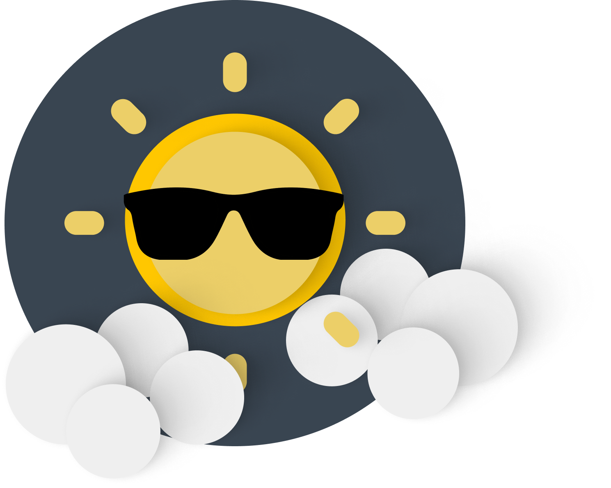

## Univsersell utforming

Universell utforming har vært et hovedfokus gjennom hele utviklingen. Den har bestått i hovedsak av følgende deler:

### 1. Kontrast

Vi bruke en kontrastskjekker til å tilpasse fargene til WCAG 2.1 kravene.

  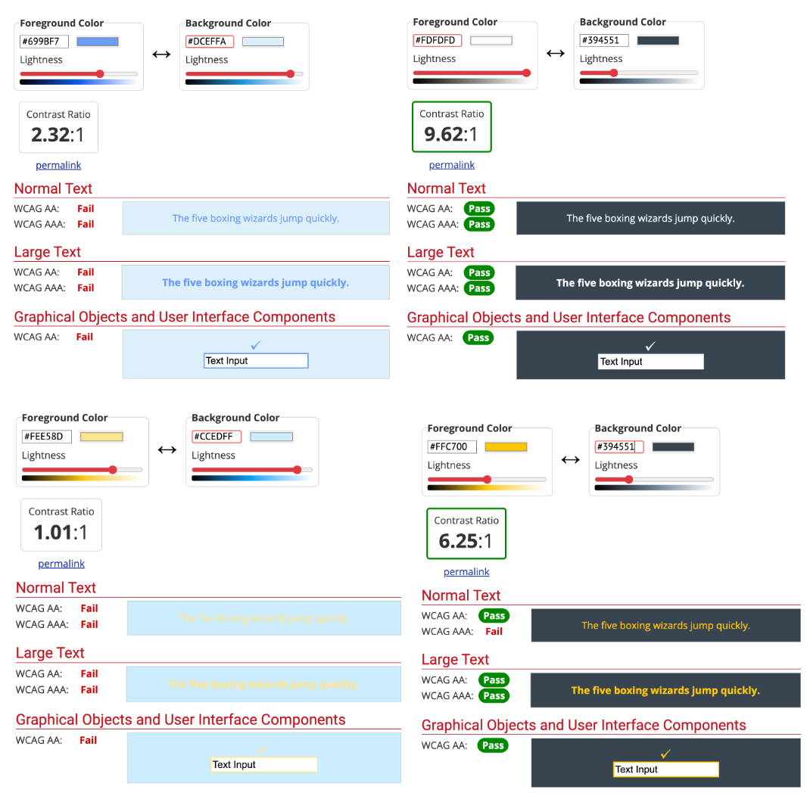

Vi endte opp med følgende fargetema:

  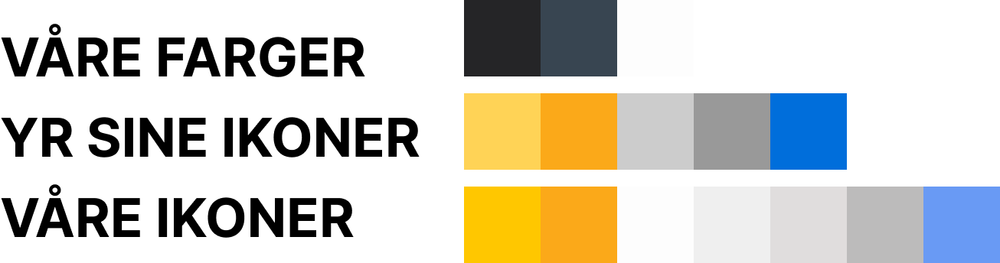

Og lagde i den forbindelse helt egne ikoner:

  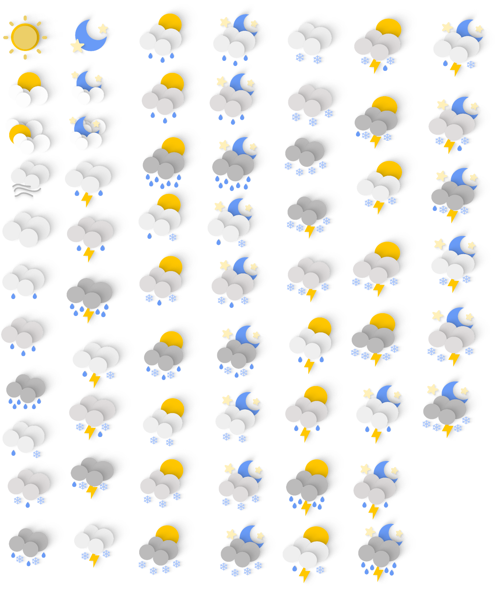

### 2. Kartlegging av WCAG 2.1 krav

Vi gikk systematisk gjennom alle WCAG 2.1 kravene og prøvde etter beste evne å innføre kravet.

  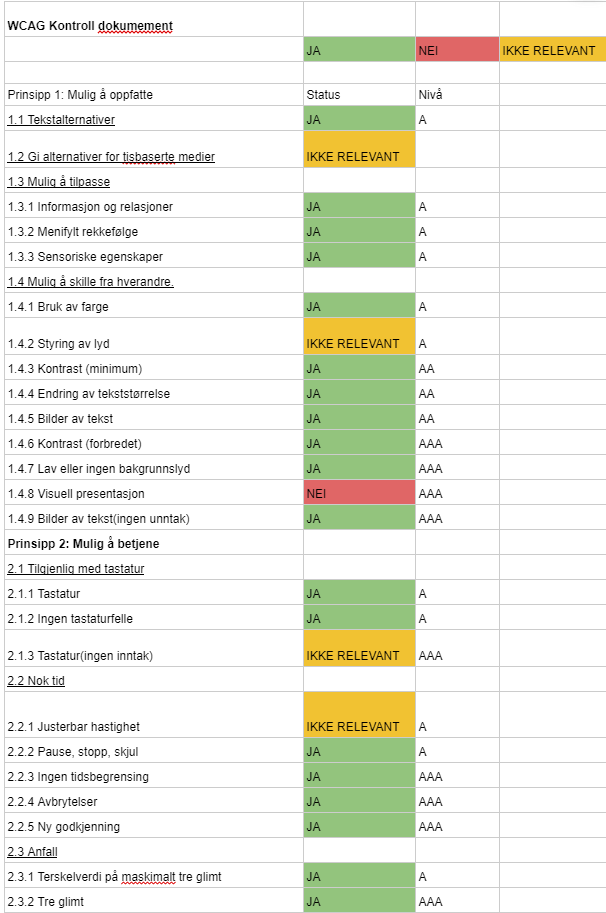
  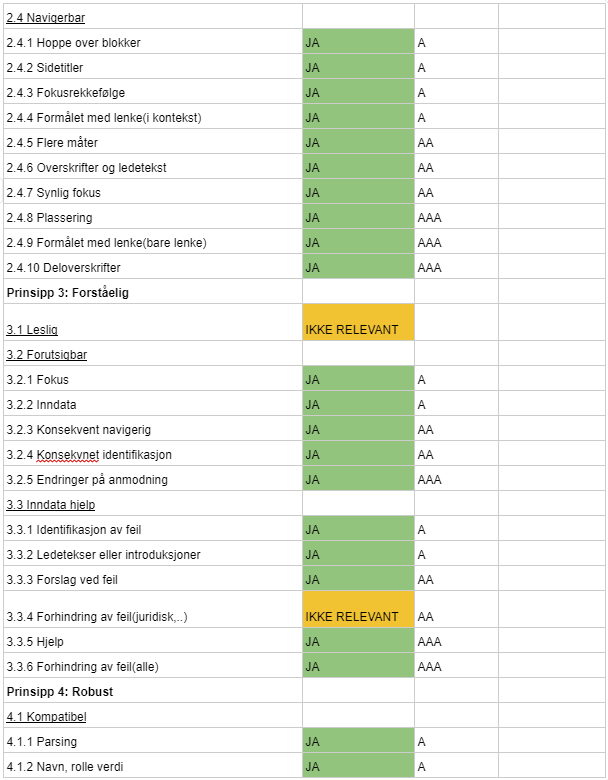

### 3. Universell utformet 

Vi endte opp med følgende endringer etter at vi tok hensyn til universell utforming og WCAG 2.1 kravene.

  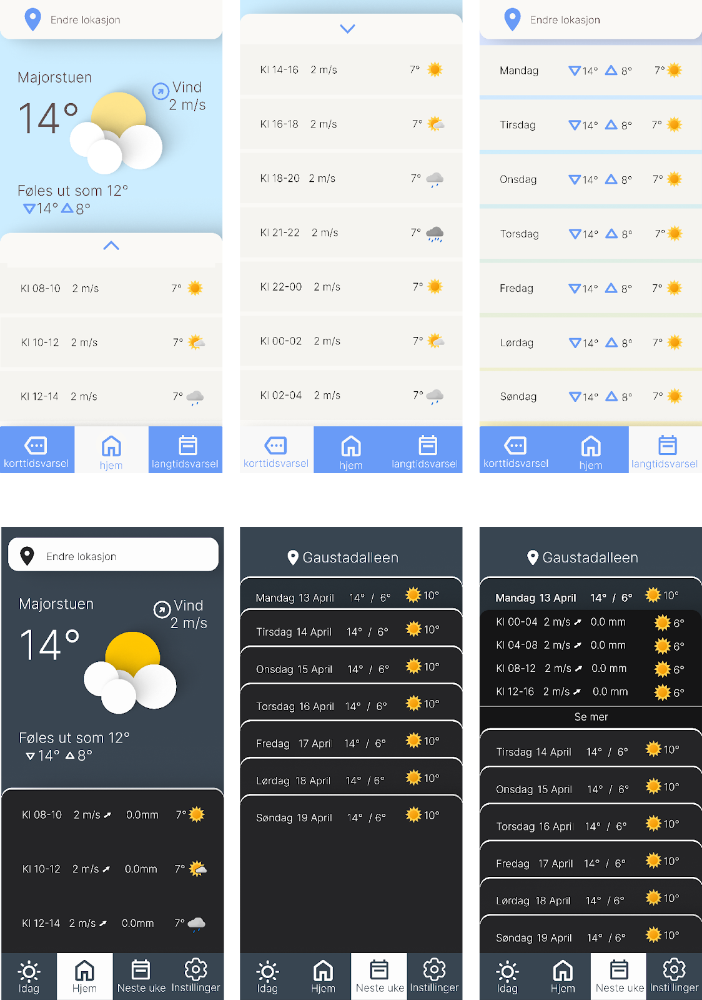

## Overblikk over funksjonalitet

Dårlig sikt er full fungerende med Android sin talkback funksjon og har følgende funksjonaliteter. 

### 1. Hjermskjerm

Brukeren kan velge om å gi samtykke til posisjonen sin eller ikke. Stedsnavn vil enten være "Aker brygger" eller nåværende posisjon.

  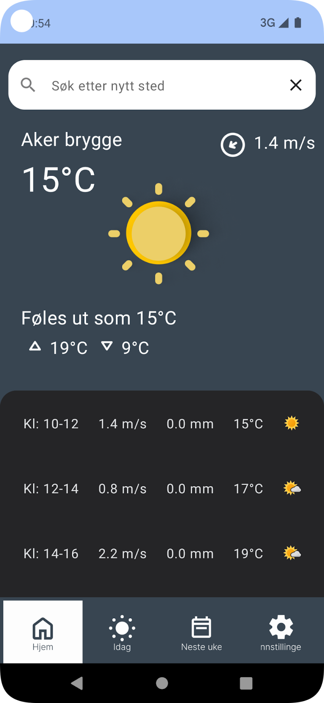

### 2. Korttidsvarsel

Her vil brukeren få et korttidsværvarsel. 

  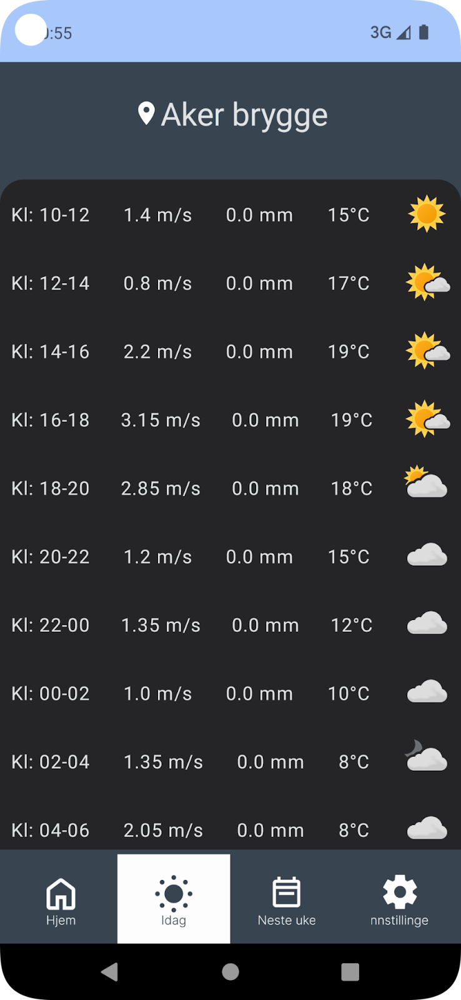

### 3. Langtidsvarsel

Her vil brukeren få et langtidsværvarsel. 

  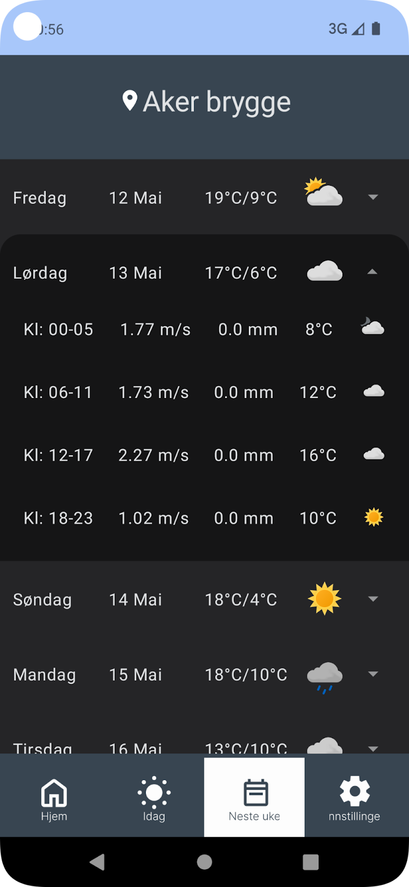

### 4. Søk

Her vil brukeren få muligheten til å søke etter en by eller sted, der man ønsker å se været fra. 

  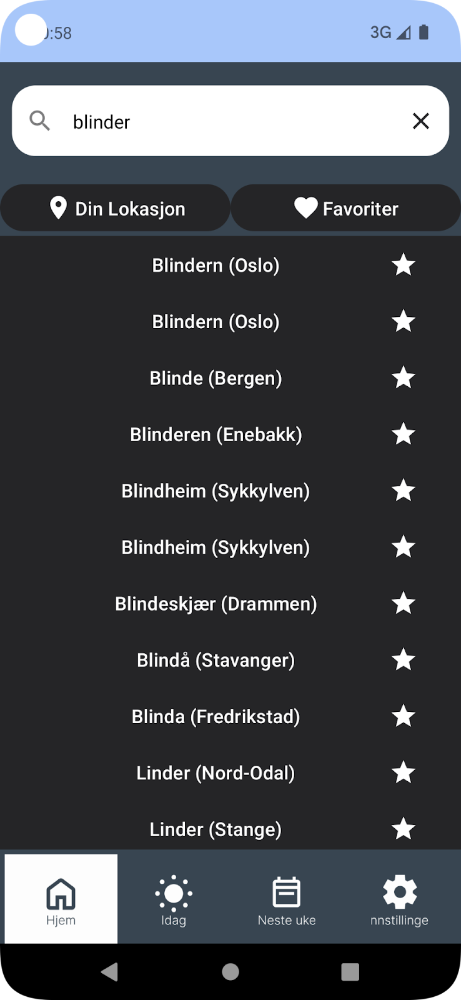

### 5. Instillinger

Her vil brukeren få muligheten til å velge mellom 1. celsius eller fahrenheit og 2. skriftstørrelse. 

  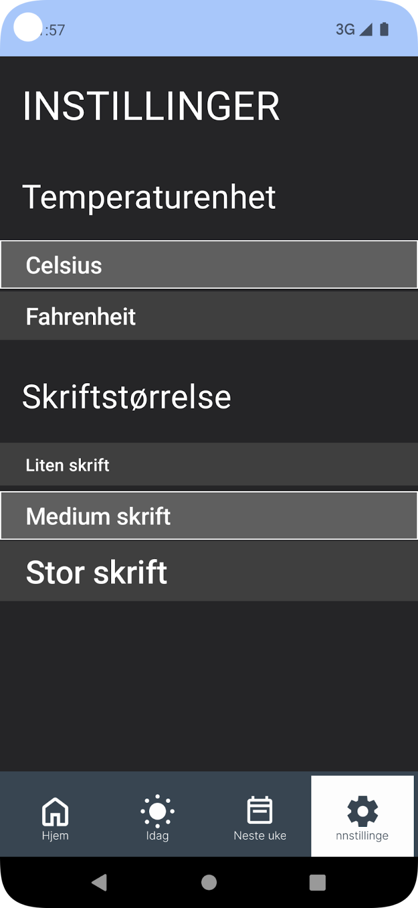

I forbindelse med at en bruker kan ha ulik tekststørrelse har vi lagt inn tekst overflow. Hvis teksten blir for stor vil teksten bryte og endre layouten. Applikasjonen tilpasser seg dermed skjermstørrelse.

  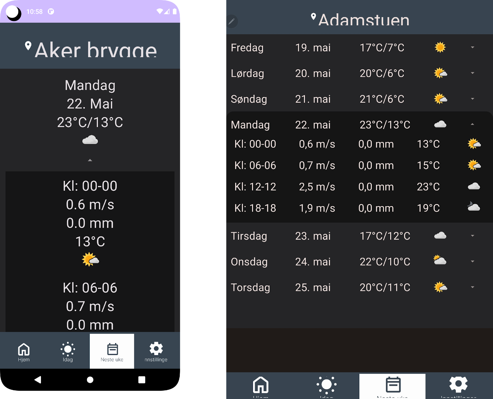

### 6. Favoritter

Her vil brukeren få muligheten til å velge ulike favoritter. 

  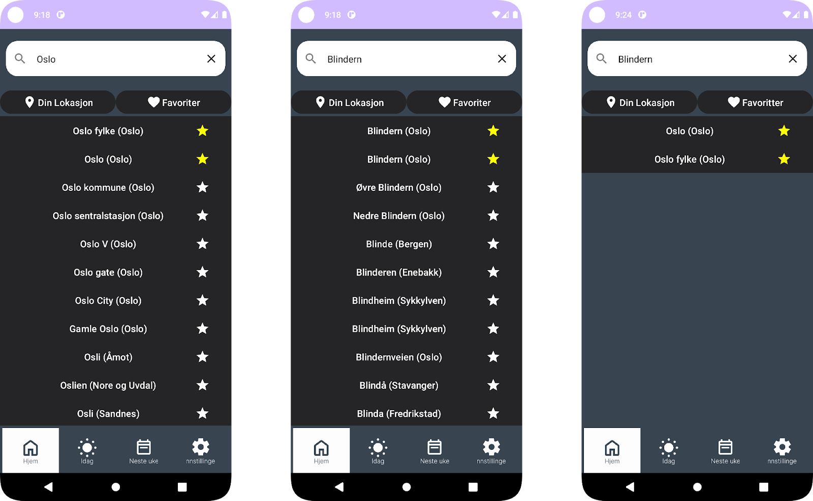

